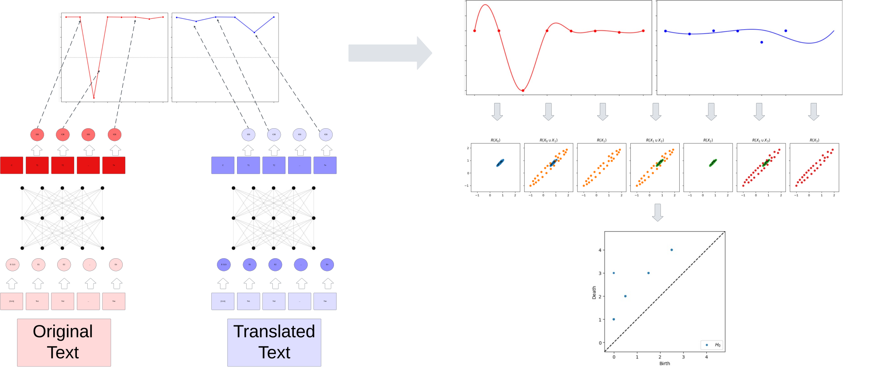

# ZigZag-Persistent-Homology-for-token-bias-in-Text-Translation
Using zig zag persistent homology to detect deliberate sentiment change via euphemism and dysphemism in text translation.  

Paper can be found here : https://www.researchgate.net/publication/393229326_Detecting_token-level_sentiment_change_in_text_translation_through_zig_zag_persistent_homology
DOI : 10.13140/RG.2.2.26171.73766

ZigZag persistence module taken from : https://github.com/sarahtymochko/BuZZ
